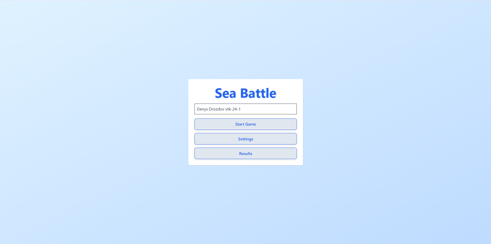

# Sea Battle Game (React + Vite + TypeScript)



## Автор

- Розробник: Денис Дроздов
- Проєкт: Sea Battle Game
- Рік: 2026

---

## Ліцензія

Цей проєкт ліцензовано за ліцензією MIT.

Дивитися повний файл ліцензії: [LICENSE](./LICENSE)

---
## Опис проєкту

Простий браузерний варіант гри **Морський Бій**, реалізований на React з використанням:

- **Vite** як bundler
- **TypeScript** для типізації
- **Tailwind CSS** для стилізації
- **React Hook Form** для налаштувань гри
- **Zustand** для глобального стану гри

Проєкт розбитий на п’ять логічних кроків:

---

## Кроки реалізації

### 1. Каркас застосунку

- Створено базові сторінки: **Start**, **Game**, **Results**.
- Початкові стани та плейсхолдери для компонентів.
- Структура проекту дозволяє легке перевикористання компонентів.

### 2. Основна логіка гри

- Додані кастомні хуки для управління станом гри (`useGame`).
- Кожен компонент залишився максимально чистим.
- Реалізація базового процесу ходів: `fire`, `restart`.

### 3. Налаштування гри

- Реалізована форма налаштувань з **React Hook Form** та валідацією.
- Налаштування включають: складність, розмір дошки, максимальну кількість ходів.
- Додано **портал для GameOverModal**, який показує завершення гри та варіанти перезапуску або переходу до результатів.

### 4. Стилізація та роутинг

- Використано **Tailwind CSS** для стилізації компонентів та гри.
- Реалізовано **динамічний роутинг** через React Router з підтримкою `userId`.
- Структура проекту дозволяє легке додавання нових сторінок.

### 5. Глобальний стан

- Використано **Zustand** для управління глобальним станом: налаштування гри, результати користувачів.
- Логіка гри інтегрована з глобальним state.
- Зберігання результатів гри та налаштувань у **localStorage**.

---

## Скриншот гри


---

## Запуск проекту

```bash
# Встановити залежності
npm install

# Запуск у режимі розробки
npm run dev

# Білд для продакшну
npm run build

# Запустити Storybook
npm run storybook

# Згенерувати документацію

```
